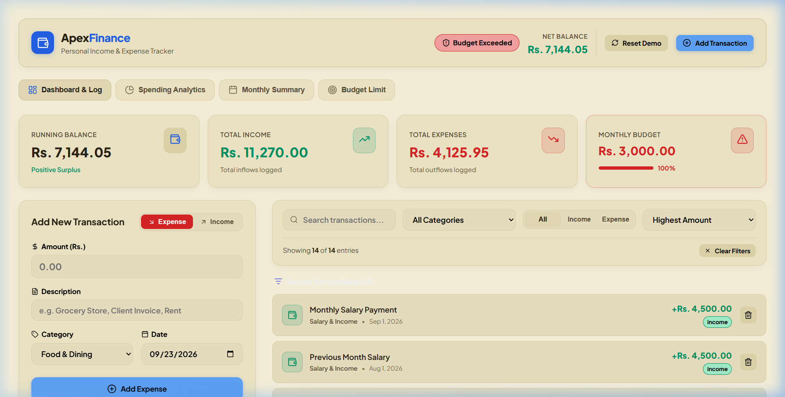

# ApexFinance - Personal Income & Expense Tracker

A modern, responsive, and minimalist React application for logging income and expenses, monitoring running balances, and visualizing spending habits at a glance. Built with clean component architecture, custom React hooks, and real-time `localStorage` persistence.


---

## Features Implemented

### Core Features
- **Add Transactions**: Easily record income and expense entries with amount (in Rs.), category selection, date picker, description, and income vs. expense type toggles.
- **Running Balance Calculation**: Automatically calculates and displays real-time Net Balance (`Income - Expenses`), Total Inflows, and Total Outflows.
- **Transaction Log & Item Deletion**: Interactive transaction list with category icons, formatted currency, date badges, and one-click item deletion with confirmation tooltips.
- **Multi-Criteria Filtering & Searching**: Filter transactions by search query, category, or type (All, Income, Expense), and sort by date (Newest/Oldest) or amount.
- **LocalStorage Data Persistence**: Automatically saves transactions and budget configuration to browser `localStorage` so data persists across browser sessions. Pre-loaded with realistic sample data for instant demo exploration.

### Stretch Goals
- **Interactive Category Spending Charts**: Visual breakdown of category expenses with dynamic bar charts and donut SVG graph views, percentage metrics, and color-coded legends.
- **Monthly Summary View**: Grouping of transactions by calendar month with total monthly income, monthly expenses, net results, and retained savings rate percentage indicators.
- **Budget Limit & Over-Budget Warning**: Custom monthly budget threshold configuration with progress utilization bar and warning alerts when total expenses exceed budget limits.


## Technologies & Libraries Used

- **React 18**: Functional components, custom hooks (`useState`, `useEffect`, `useMemo`), and prop-driven state flow.
- **Vite 8**: High-performance frontend bundler and development server.
- **Lucide React**: Clean, modern icon set for category icons and UI controls.
- **Vanilla CSS**: Custom design system with glassmorphism, responsive CSS Grid / Flexbox, CSS variables, and modern dark mode typography.
- **Browser LocalStorage API**: Persistent client-side data storage without requiring an external backend server.


## Setup & Running Instructions

### Prerequisites
Make sure you have [Node.js](https://nodejs.org/) (v16+ recommended) installed on your system.

### 1. Installation
Clone or navigate into the project directory and install dependencies:
```bash
cd "c:/react project"
npm install
```

### 2. Start Development Server
Launch the local development server:
```bash
npm run dev
```
Open your browser and navigate to `http://localhost:5173` (or the local URL printed in your terminal).

### 3. Build for Production
To generate a production-ready optimized bundle:
```bash
npm run build
```


## Application Screenshots

| View | Preview |
| --- | --- |
| **Main Dashboard & Transaction Log** |  |


## Project Folder Structure

c:/react project/
├── index.html
├── package.json
├── README.md
├── vite.config.js
├── public/
│   └── screenshots/
│       └── dashboard.png
└── src/
    ├── main.jsx
    ├── App.jsx
    ├── index.css
    ├── components/
    │   ├── Header.jsx
    │   ├── Navigation.jsx
    │   ├── StatCards.jsx
    │   ├── TransactionForm.jsx
    │   ├── TransactionFilters.jsx
    │   ├── TransactionList.jsx
    │   ├── TransactionItem.jsx
    │   ├── CategoryChart.jsx
    │   ├── MonthlySummary.jsx
    │   ├── BudgetLimit.jsx
    │   └── EmptyState.jsx
    ├── hooks/
    │   └── useTransactions.js
    └── utils/
        ├── categories.js
        ├── formatters.js
        └── initialData.js


## Known Limitations & Future Enhancements

- **Export & Import Data**: CSV or JSON export functionality for financial reporting could be added in a future update.
- **Multi-Currency Support**: Currently defaults to Rupee (`Rs.`) formatting; dynamic currency switching could be implemented.
- **Recurring Transactions**: Auto-logging recurring monthly bills or salaries on set days of the month.
